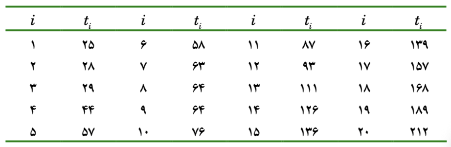

## روش عددی مثال ۶.۱

اگر بخواهیم دو پارامتر توزیع وایبول را برآورد کنیم از این فرمول گشتاوری می توانیم استفاده کنیم:

$$\frac{\gamma(1 + \frac{2}{\beta})}{\gamma^2(1 + \frac{2}{\beta})} = \frac{m_2}{m^2_1}$$

بعد کسر سمت راست را به سمت چپ می بریم:

$$\frac{\gamma(1 + \frac{2}{\beta})}{\gamma^2(1 + \frac{2}{\beta})} - \frac{m_2}{m^2_1} = 0$$

داده هایی که داریم به این صورت هستند:

```{r}
#| dir: ltr

i <- c(1:25)
t2 <- c(391,510,541,595,622,626,680,694,710,715,746,763,775,932,957,984,1003,1019,1031,1083,1223,1279,1285,1393,1577)
x <- cbind(i,t)
t2
```

حالا تابع را در R تعریف می کنیم:

```{r}
#| dir: ltr

m1 <- mean(t2)
m2 <- mean(t2^2)
f2 <- function(beta, m1, m2){
  gamma(1 + 2/beta) / gamma(1 + 1/beta)^2 - m2/m1^2
}
```

```{r}
#| dir: ltr

op <- uniroot(f2,
        interval = c(0.1,40),
        m1 = m1,
        m2 = m2)

beta <- op$root
beta
```

از تابع uniroot استفاده کردیم تا beta را بدست بیاوریم

که می شود: $$\beta = 3.298232$$

حالا

$$\hat{\lambda}$$

را نیز پیدا می کنیم:

```{r}
#| dir: ltr

lambdaHat <- (gamma(1 + 1/beta)) / m1
lambdaHat
```

حالا چون

$$\beta = 3.298232$$

$$\lambda = 0.001013137$$

را پیدا کردیم میتوانیم توزیع این داده ها بدست بیاوریم

با در نظر گرفتن داده هایی که داریم ، تابع وایبل روی این داده با تغییر پارامتر در زیر قابل مشاهده است:

```{ojs}
//| echo: false
//| dir: ltr
data = [391,510,541,595,622,626,680,694,710,715,746,763,775,932,957,984,1003,1019,1031,1083,1223,1279,1285,1393,1577]

// --- MLE fitting — returns shape k and rate λ = 1/η ---
function fitWeibullMLE(d) {
  const n = d.length
  let k = 1.5
  for (let iter = 0; iter < 300; iter++) {
    const xk      = d.map(x => Math.pow(x, k))
    const lnx     = d.map(x => Math.log(x))
    const S0      = xk.reduce((a, b) => a + b, 0) / n
    const S1      = d.map((_, i) => xk[i] * lnx[i]).reduce((a, b) => a + b, 0) / n
    const S2      = d.map((_, i) => xk[i] * lnx[i] * lnx[i]).reduce((a, b) => a + b, 0) / n
    const meanLnx = lnx.reduce((a, b) => a + b, 0) / n
    const num     = 1 / k + meanLnx - S1 / S0
    const den     = -1 / (k * k) - (S2 * S0 - S1 * S1) / (S0 * S0)
    k = Math.max(0.1, k - (num / den) * 0.5)
  }
  const eta = Math.pow(d.map(x => Math.pow(x, k)).reduce((a, b) => a + b, 0) / d.length, 1 / k)
  return { shape: k, rate: 1 / eta }
}

mleFit = fitWeibullMLE(data)

// Fixed parameters
fixedShape = 3.25
fixedRate  = 0.001          // λ; scale η = 1/λ = 1000

// --- Gamma function (Lanczos) ---
function gammaFn(z) {
  const g = 7
  const c = [0.99999999999980993,676.5203681218851,-1259.1392167224028,
             771.32342877765313,-176.61502916214059,12.507343278686905,
             -0.13857109526572012,9.9843695780195716e-6,1.5056327351493116e-7]
  if (z < 0.5) return Math.PI / (Math.sin(Math.PI * z) * gammaFn(1 - z))
  z--
  let x = c[0]
  for (let i = 1; i < g + 2; i++) x += c[i] / (z + i)
  const t = z + g + 0.5
  return Math.sqrt(2 * Math.PI) * Math.pow(t, z + 0.5) * Math.exp(-t) * x
}

// --- Weibull functions (β, λ) where η = 1/λ ---
weibullPDF = (x, b, lam) => { const eta = 1/lam; return x<=0 ? 0 : (b/eta)*Math.pow(x/eta,b-1)*Math.exp(-Math.pow(x/eta,b)) }
weibullCDF = (x, b, lam) => { const eta = 1/lam; return x<=0 ? 0 : 1-Math.exp(-Math.pow(x/eta,b)) }
weibullHaz = (x, b, lam) => { const eta = 1/lam; return x<=0 ? 0 : (b/eta)*Math.pow(x/eta,b-1) }
weibullMean   = (b, lam) => (1/lam) * gammaFn(1 + 1/b)
weibullMedian = (b, lam) => (1/lam) * Math.pow(Math.LN2, 1/b)
weibullStd    = (b, lam) => { const eta=1/lam; return Math.sqrt(eta*eta*(gammaFn(1+2/b)-Math.pow(gammaFn(1+1/b),2))) }
weibullB10    = (b, lam) => (1/lam) * Math.pow(-Math.log(0.9), 1/b)

//| echo: false
// Controls
viewof shape = Inputs.range([0.5, 5], {
  value: fixedShape,
  step: 0.01,
  label: "Shape β"
})

viewof rate = Inputs.range([0.0002, 0.005], {
  value: fixedRate,
  step: 0.00001,
  label: "Rate λ"
})

viewof plotType = Inputs.radio(["PDF", "CDF", "Probability plot", "Hazard rate"], {
  value: "PDF",
  label: "Chart"
})

html`<p style="font-size:13px;color:#666;margin:2px 0 12px">
  Scale η = 1/λ = <strong>${(1/rate).toFixed(1)}</strong>
</p>`

//| echo: false
{
  const sorted = [...data].sort((a, b) => a - b)
  const n = sorted.length
  const eta = 1 / rate
  const xmin = Math.min(...data) * 0.85
  const xmax = Math.max(...data) * 1.1
  const pts = 300
  const xs = Array.from({ length: pts }, (_, i) => xmin + (xmax - xmin) * i / (pts - 1))

  if (plotType === "PDF") {
    const bins = 12
    const w = (xmax - xmin) / bins
    const counts = Array(bins).fill(0)
    sorted.forEach(v => {
      let b = Math.floor((v - xmin) / w)
      if (b >= bins) b = bins - 1
      if (b >= 0) counts[b]++
    })
    const histData = counts.map((c, i) => ({
      x0: xmin + i * w,
      x1: xmin + (i + 1) * w,
      density: c / (n * w)
    }))
    const lineData = xs.map(x => ({ x, y: weibullPDF(x, shape, rate) }))
    return Plot.plot({
      width: 680, height: 300,
      x: { label: "Time" },
      y: { label: "Density" },
      marks: [
        Plot.rectY(histData, { x1: "x0", x2: "x1", y: "density", fill: "#378ADD", fillOpacity: 0.25, stroke: "#378ADD", strokeOpacity: 0.5 }),
        Plot.line(lineData, { x: "x", y: "y", stroke: "#378ADD", strokeWidth: 2 }),
        Plot.ruleY([0])
      ]
    })
  }

  if (plotType === "CDF") {
    const empData = sorted.map((x, i) => ({ x, y: (i + 0.3) / (n + 0.4) }))
    const lineData = xs.map(x => ({ x, y: weibullCDF(x, shape, rate) }))
    return Plot.plot({
      width: 680, height: 300,
      x: { label: "Time" },
      y: { label: "F(t)", domain: [0, 1] },
      marks: [
        Plot.line(lineData, { x: "x", y: "y", stroke: "#378ADD", strokeWidth: 2 }),
        Plot.dot(empData, { x: "x", y: "y", fill: "#378ADD", fillOpacity: 0.5, r: 5 }),
        Plot.ruleY([0])
      ]
    })
  }

  if (plotType === "Probability plot") {
    const empY = sorted.map((_, i) => (i + 0.3) / (n + 0.4))
    const pointData = sorted.map((x, i) => ({
      lnx: Math.log(x),
      lnln: Math.log(-Math.log(1 - empY[i]))
    }))
    const fitXs = xs.filter(x => x > 0)
    const lineData = fitXs.map(x => ({
      lnx: Math.log(x),
      lnln: shape * (Math.log(x) - Math.log(eta))
    }))
    return Plot.plot({
      width: 680, height: 300,
      x: { label: "ln(t)" },
      y: { label: "ln(−ln(1−F))" },
      marks: [
        Plot.line(lineData, { x: "lnx", y: "lnln", stroke: "#378ADD", strokeWidth: 2 }),
        Plot.dot(pointData, { x: "lnx", y: "lnln", fill: "#378ADD", fillOpacity: 0.5, r: 5 })
      ]
    })
  }

  if (plotType === "Hazard rate") {
    const lineData = xs.map(x => ({ x, y: weibullHaz(x, shape, rate) }))
    return Plot.plot({
      width: 680, height: 300,
      x: { label: "Time" },
      y: { label: "h(t)" },
      marks: [
        Plot.line(lineData, { x: "x", y: "y", stroke: "#D85A30", strokeWidth: 2 }),
        Plot.ruleY([0])
      ]
    })
  }
}

//| echo: false
html`<details style="margin-top:16px;font-size:13px;color:#555">
  <summary style="cursor:pointer;font-weight:500">Parameter reference</summary>
  <table style="margin-top:8px;border-collapse:collapse;width:100%;font-size:13px">
    <tr style="border-bottom:1px solid #ddd">
      <th style="text-align:left;padding:4px 8px"></th>
      <th style="padding:4px 8px">β (shape)</th>
      <th style="padding:4px 8px">λ (rate)</th>
    </tr>
    <tr>
      <td style="padding:4px 8px;color:#666">Fixed</td>
      <td style="padding:4px 8px;text-align:center"><strong>${fixedShape}</strong></td>
      <td style="padding:4px 8px;text-align:center"><strong>${fixedRate}</strong></td>
    </tr>
    <tr style="background:#f9f9f9">
      <td style="padding:4px 8px;color:#666">MLE fit</td>
      <td style="padding:4px 8px;text-align:center">${mleFit.shape.toFixed(4)}</td>
      <td style="padding:4px 8px;text-align:center">${mleFit.rate.toFixed(6)}</td>
    </tr>
    <tr>
      <td style="padding:4px 8px;color:#666">Current</td>
      <td style="padding:4px 8px;text-align:center">${shape.toFixed(4)}</td>
      <td style="padding:4px 8px;text-align:center">${rate.toFixed(6)}</td>
    </tr>
  </table>
  <p style="margin:8px 0 0">
    ${shape > 1 ? "β > 1 → increasing failure rate (wear-out)" :
      shape < 1 ? "β < 1 → decreasing failure rate (infant mortality)" :
      "β ≈ 1 → constant failure rate (random failures)"}
  </p>
</details>`

```

## ۶.۶ حل روش عددی مثال

{group="my-group"}

اول از همه ما یک سری داده داریم که در جدول زیر مشخص شده است.

{group="my-group"}

```{r}
#| dir: ltr

data <- cbind(c(1:20), c(25,28,29,44,57,58,63,64,64, 76,87,93,111,126,136,139,157,168,189,212))
data
```

```{r}
#| dir: ltr

y <- data[,2]
y
```

فرمول **وایبل** نیز به این صورت است: $$f(t,\lambda, \beta) = \beta\lambda^{\beta}t^{\beta-1}e^{-(\lambda t)^\beta}$$

که likelihood آن هم به این شکل می شود

$$l(\lambda , \beta) = \sum_{i=1}^{n} [ln(\beta) + \beta ln(\lambda) + (\beta - 1) ln(t_i) - (\lambda t_i)^\beta]$$

که حالا اگر sum را روی آنها تاثیر بدهیم به این شکل می شود $$l(\lambda , \beta) =  [nln(\beta) + n\beta ln(\lambda) + (\beta - 1) \sum_{i=1}^{n} ln(t_i) - \sum_{i=1}^{n}(\lambda t_i)^\beta]$$

در کتاب آورده شده است که میتوان مستقیما این فرمول را ماکزیمم کرد یا از مشتق آن به صورت تکرار اعداد را بدست آورد.

ما به صورت مستقیم از تابع likelihood استفاده میکنیم به این شکل که :

تابعی که میخواهیم آن را ماکزیمم کنیم را در R می نویسیم

تابع را در دستور optim() قرار می دهیم

تابع بالا در R به صورت زیر قابل تعریف شدن است:

```{r}
#| dir: ltr
f <- function(params, y){
  
  lambda <- params[1]
  beta <- params[2]
  n <- length(y)
  
  n*log(beta) + n*beta*log(lambda) + (beta - 1)*sum(log(y)) - 
    sum((lambda * y)^beta)
  
}
```

بعد از تعریف تابع باید این تابع را به روش های عددی ماکزیمم کنیم:

```{r}
#| warning: false
#| dir: ltr
initialval <- c(1,1)
output <- optim(initialval, f,
      y = y,
      control = list(fnscale = -1),
      method = "BFGS",
      hessian = TRUE)
output
```

اول از همه یک نقطه شروع برای پارامتر ها در نظر می گیریم که در initialvalue آنها را قرار می دهیم که برای هر دو پارامتر 1, 1 در نظر گرفته شد

تابع optim() را فراخوانی می کنیم و اول از همه مقادیر اولیه را در آن قرار می دهیم.

بعد از آن تابع f که میخواهیم بهینه سازی کنیم را در تابع قرار می دهیم

بعد از آن داده هایی که از مسئله داشتیم را درون تابع optim() جایگذاری میکنیم

تابع optim به صورت default تابعی که داریم را مینیمم می کند با دستوری که قرار دادیم control = list(fnscale = -1) ، تابعی که در optim() قرار می دهیم خروجی ماکزیمم خواهد بود.

method و hessian هم به روشی که برای بدست آورد جواب نیاز داریم اشاره می کند.

یا اگر طبق فرمول 6.12 پیش برویم که برابر است با :

$$\lambda = [\frac{1}{n} \sum_{i=1}^{n} t_i^{\beta}]^{-\frac{1}{\beta}}$$

```{r}
#| dir: ltr


lm <- function(y,betaP){
  n <- length(y)
  lambda <- ( (1/n) * sum(y^betaP) )^(-1/betaP)
  lambda
}
```

```{r}
#| dir: ltr

lm(y,output$par[2])
```

که با فرمول خود کتاب هم که محاسبه شد عددی نزدیک به عددی که برآورد شد یعنی 0.009184599 به دست آمد که یعنی برآورد ما طبق کتاب نیز درست است.

د